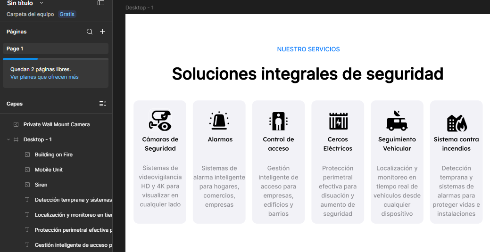

# TP - Diseño y planificación de sitio web

## 1. Intereses personales

Mis principales intereses están relacionados con la tecnología y la informática. Me interesa la programación, el desarrollo de páginas web, las redes, la reparación de computadoras y los sistemas de seguridad como cámaras y alarmas.

También me interesa aprender a desarrollar soluciones que puedan ser útiles para personas y empresas.

---

## 2. Tema elegido

Sitio web corporativo para una empresa de Seguridad Electrónica e Inteligente (SIS).
Justificación: Elegí este tema porque me permite aplicar mis intereses en el desarrollo web interactivo a un caso de uso real y de alta demanda. El rubro de la seguridad electrónica requiere un sitio que transmita confianza y solidez, lo que representa un gran desafío de diseño UI/UX. Además, me permite integrar herramientas interactivas que me interesan, como formularios de relevamiento a medida, botones de contacto rápido vía WhatsApp y secciones de asesoramiento dinámico para los usuarios.

## 3. Sitios web de referencia

Para este rubro, estas son 5 referencias del mercado de seguridad y tecnología con sus respectivos análisis para que incluyas en tu TP:

## ADT (adt.com.ar)

Positivos: Excelente jerarquía visual en los botones de "Llamada a la acción" (CTA); paleta de colores que transmite alerta y seguridad; buena adaptación a dispositivos móviles (responsive).

Negativos: Exceso de ventanas emergentes (pop-ups) comerciales; la carga de la página puede ser lenta por scripts de seguimiento; algunas secciones de texto son muy densas.

## Prosegur (prosegur.com.ar)

Positivos: Navegación por pestañas muy clara para separar "Hogares" de "Empresas"; portal de autogestión de clientes bien integrado; uso de iconografía intuitiva.

Negativos: El menú desplegable principal es demasiado extenso y puede confundir; los precios o planes base son difíciles de encontrar; el diseño del footer está sobrecargado de enlaces.

## X-28 Alarmas (x-28.com)

Positivos: Fuerte presencia de canales de contacto directo (WhatsApp visible en todo momento); explicaciones de productos muy directas y al grano; reconocimiento de marca local muy bien explotado.

Negativos: Interfaz de usuario (UI) un poco anticuada frente a la competencia; imágenes de producto de menor calidad; las transiciones entre páginas son algo toscas.

## Hikvision (hikvision.com)

Positivos: Fotografía de producto en altísima calidad; diseño web moderno y limpio; fichas técnicas de equipos extremadamente detalladas.

Negativos: Orientado más a instaladores/distribuidores que al consumidor final; lenguaje demasiado técnico; el mapa del sitio es muy profundo y complejo de navegar.

## Ring (ring.com)

Positivos: Interfaz minimalista y moderna orientada al "Smart Home"; excelente uso de videos cortos para demostrar cómo funciona el producto; proceso de compra integrado impecable.

Negativos: Ecosistema muy cerrado solo a sus productos; carece de secciones orientadas a soluciones empresariales complejas; soporte técnico difícil de contactar de forma directa.
# 4. Wireframes a mano

Se realizarán bocetos en papel para definir la estructura y distribución de los elementos principales del sitio web.

# 5. Mapa del sitio

La estructura general del sitio será la siguiente:
SITIO WEB
│
├── Inicio (Home)
│
├── Nosotros
│   └── La Empresa
│
├── Servicios
│   ├── Cámaras de Seguridad
│   ├── Sistemas de Alarmas
│   ├── Control de Accesos
│   ├── Cercos Eléctricos
│   ├── Seguimiento Vehicular
│   └── Sistemas contra Incendios
│
├── Soluciones
│   ├── Para Hogares
│   └── Para Comercios y Empresas
│
├── Contacto
│
└── Preguntas Frecuentes (FAQ)

## 6. WIDEFRAME EN FIGMA

# TP - Diseño de los mackup.
## HOME

## NOSOTROS

## SERVICIOS

## CONTACTO

